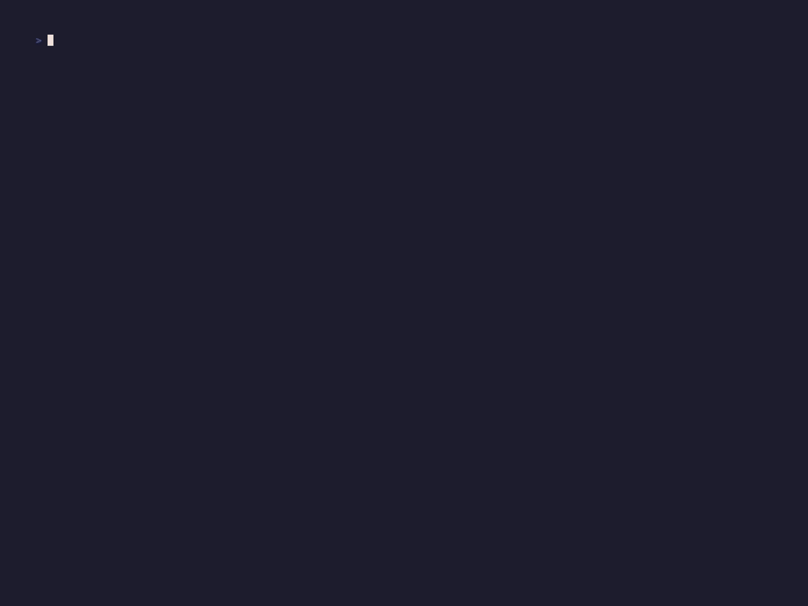

# 🔒 CRYPTO-CHECK `by 057`

> Auditoría defensiva (Blue Team) de certificados SSL/TLS y configuración de cifrado en servidores web, con interfaz TUI profesional basada en `Rich`.


---

## 📽️ Demostración en vivo



---

## 🛠️ Instalación

Asegúrate de tener un entorno Python configurado (requiere Python 3.10+, probado en 3.14 con OpenSSL 3.x):
Bash

pip install -r requirements.txt

## 🚀 Modo de Uso
Bash
```
python main.py <host> [puerto] [--timeout N]
```
Ejemplos prácticos
Bash

# Auditoría estándar por defecto (puerto 443)
```
python main.py github.com
```
# Auditoría en puerto personalizado
```
python main.py example.com 8443
```
# Modificar el tiempo de espera (Timeout)
```
python main.py intranet.local 443 --timeout 12
```
## 📊 Componentes Auditados
Sección	Contenido
- OBJETIVO	Host, IP, puerto y resolución DNS.
- CERTIFICADO X.509	Subject (CN), Issuer (CA), SANs, algoritmo de clave pública, algoritmo de firma, serial, validez, barra de expiración, indicador de autofirmado y wildcard.
- PROTOCOLOS	Versión máxima TLS y soporte real por versión (TLS 1.3 / 1.2 / 1.1 / 1.0), con alertas de protocolos inseguros.
- CIPHER SUITES	Suite negociada descompuesta (intercambio de claves, cifrado simétrico, MAC), detección de Perfect Forward Secrecy (PFS) y ciphers débiles (RC4, 3DES, MD5, NULL, EXPORT...).
- CABECERAS (HSTS)	Verificación de Strict-Transport-Security, max-age, includeSubDomains y preload.
- CALIFICACIÓN	Score global visual (A, B, C, F) con desglose de razones y advertencias.
## 🎯 Matriz de Calificación (Scoring)

    Grade A: TLS 1.2/1.3, ciphers fuertes, certificado válido por más de 30 días, HSTS presente.

    Grade B: Certificado válido y TLS moderno, pero sin HSTS o caducando pronto (< 30 días).

    Grade C: Advertencias de cifrado (sin PFS, firma SHA-1/MD5, cipher débil).

    Grade F: Certificado caducado o autofirmado, o presencia de protocolos inseguros (TLS 1.0/1.1/SSLv3) activos.

## ⚙️ Notas Técnicas y Arquitectura

    Inspección Permisiva: El certificado se captura sin validación local (CERT_NONE) a propósito, permitiendo auditar certificados autofirmados o caducados.

    Sondeo Legacy: El análisis de protocolos obsoletos utiliza SECLEVEL=0 a nivel local para permitir que versiones modernas de OpenSSL ofrezcan TLS 1.0/1.1; si el entorno de ejecución lo bloquea, se reporta como "no comprobable".

    Detección Anti-Falsos Positivos: Si un handshake legacy aceptado presenta un certificado distinto al del handshake moderno, la herramienta lo marca como "Posible proxy TLS intermedio; resultado no fiable" (común en redes corporativas con inspección SSL/TLS).

    Concurrencia: Las peticiones HTTP (HSTS) y el sondeo TLS se ejecutan en un grupo de hilos (thread pool) para mantener la interfaz TUI fluida sin bloqueos.

    Manejo de Errores Controlado: Fallos de resolución DNS (socket.gaierror), tiempos de espera agotados, errores de SSL (ssl.SSLError), conexiones rechazadas y la interrupción manual (Ctrl+C) se capturan limpiamente y se despliegan en paneles de error formateados sin mostrar tracebacks crudos.

## 📁 Estructura del Proyecto
```
├── main.py           # Entry point, parseo de CLI (argparse) y control global de excepciones.
├── scanner.py        # Clase CryptoCheckAuditor (Sockets, certificados, sondeo TLS, HSTS, Scoring).
├── ui.py             # Clase CryptoTUI (Banner, layout de cuadrícula, paneles y renderizado de score).
└── requirements.txt  # Dependencias del proyecto (Rich, pyOpenSSL, cryptography, etc.).
```
## ⚠️ Aviso Legal / Disclaimer
- Herramienta de Auditoría Defensiva: Este software ha sido desarrollado exclusivamente para análisis defensivo, auditorías de cumplimiento y verificación de seguridad. Utilízalo únicamente sobre sistemas propios o en entornos donde cuentes con autorización explícita del propietario.
